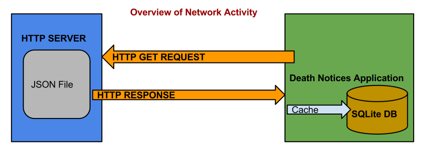
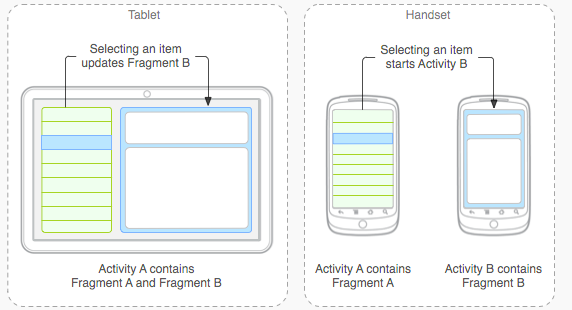
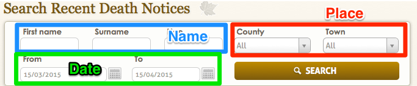
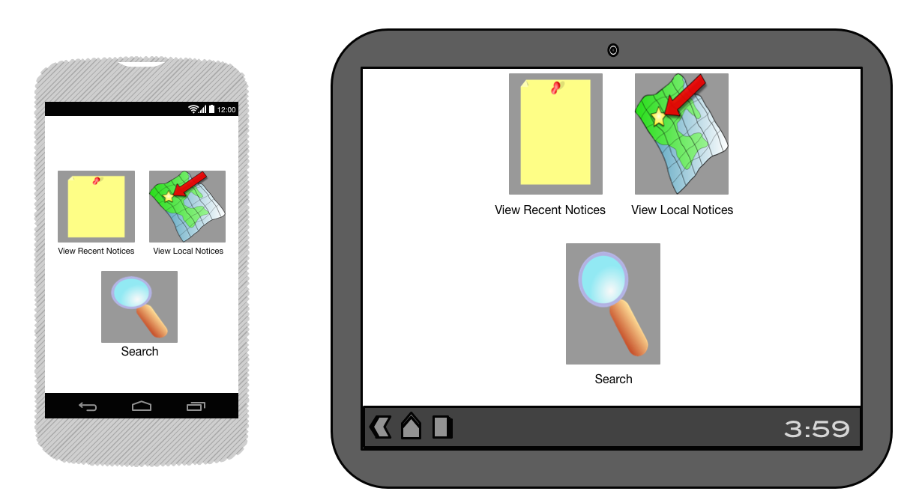
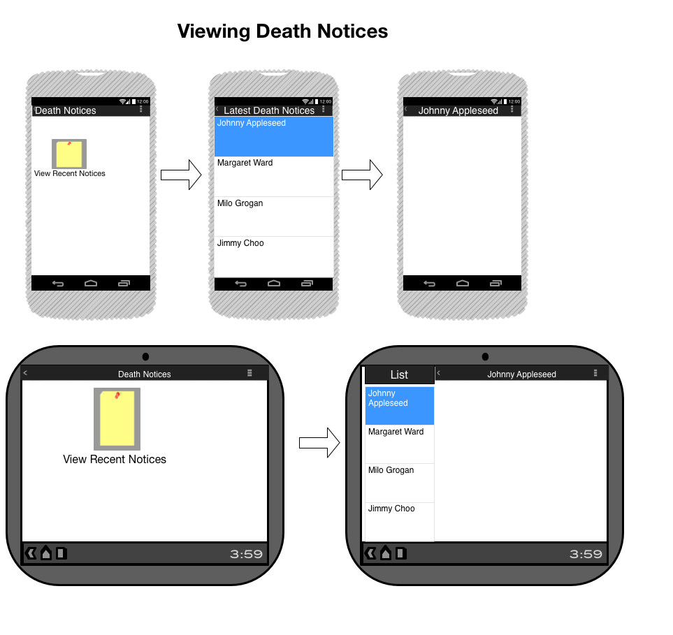
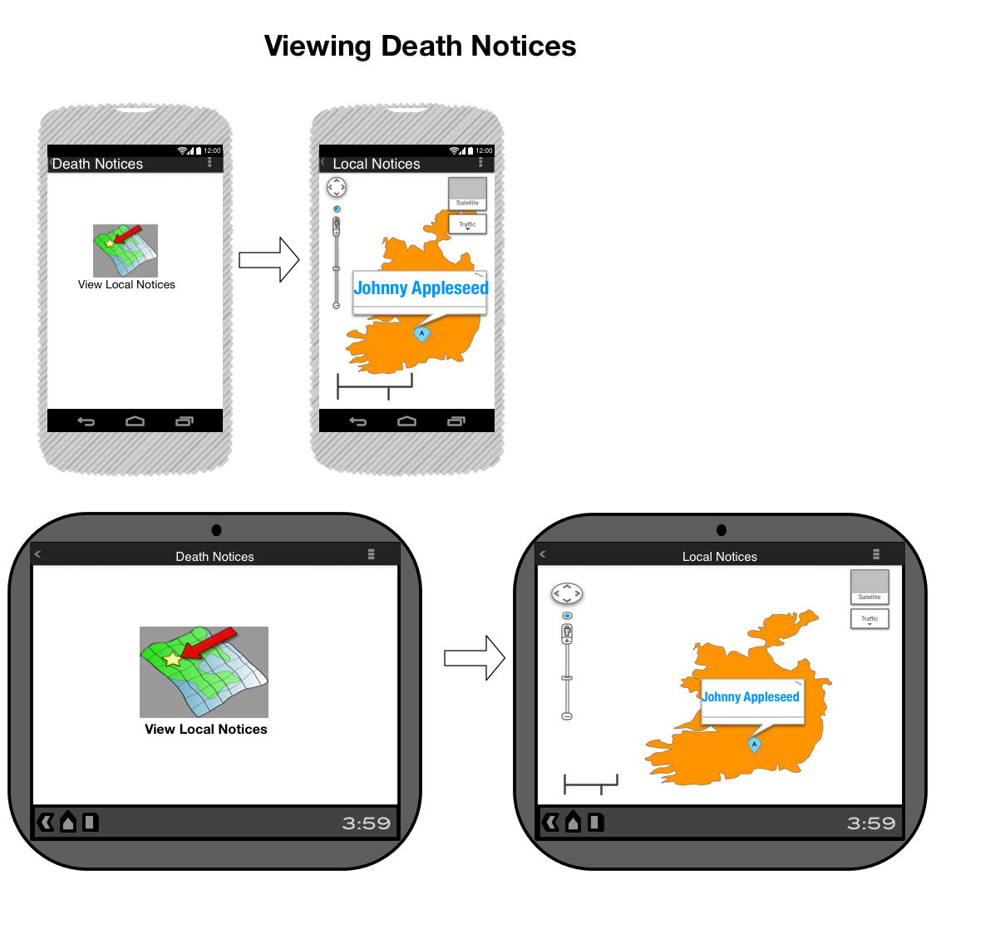

# Android Project Analysis - Death Notices 
### by Neil Grogan 13204052

<!--BREAK-->

## Abstract
This report details the creation of a death notices application for older
people, on the Android platform. It was done as a proof of concept and to learn 
about the android platform from a development point of view.

<!--BREAK-->
## Table of Contents
<!--TOC-->
<!--BREAK-->

## Application Overview
### Introduction 
I have created an application for death notices. It caters to a market often
left out by the digital revolution: older people. It is also a pretty unique
application for the Irish market, as I will show.

### Design Aims
The main aims of my chosen app design is as follows:

* to be easy to use
* to be clearly laid out and use simple language
* to use big touch areas (for those with dexterity issues)

Although these design aims sound easy, it is actually harder to cut
functionality and features as a developer. This is essential however to keep the
audience for the application in mind.

## Research
Before starting to write the application, I did market research to find similar
applications. Surprisingly, there are not many applications in this particular
area. 

### Key information
I also started to critically analyse the existing websites in Ireland for what
they did well or what seemed to work. Clear themes soon emerged:

* [rip.ie][] was the most trusted, as it is updated by funeral directors. This
  means that their data reliability was second-to-none. This came as a surprise due to the other larger players in this market.
* Search seemed to entirely revolve around name or place
* Business models seemed to be:
	* Charge per notice
	* Charge funeral directors a monthly fee
	* Carry advertisements
* Single purpose websites, even when part of a larger business

### Selected Similar Applications
I trawled the Google Play Store with keywords similar to those I would use to
describe my application. I managed to find the following:

| Application Name  | Purpose | Of Interest to Design |
| ------------- | ------------- |
| Old Maid Card Game  | A victorian card game for 2-8 players whereby the person who gets a Queen Card is the Old Maid and loses the game  | Very Simple to use; Language easy to understand; Everything is Big; Very colourful and simple basic instructions. |
| Obituary App  | American Based - Directly comparitive | Picture of the person, Sentence of something important/meaningful they did, Very nicely laid out, Very colourful and also nice and big. |
| The Funeral App |  | Ability to chose the city/town/village you live in, notifications of new obituaries added, also very colourful and nicely laid out. |
| Old Person App | | A magnifying glass, flashlight and large-print notebook in one simple app. Very big and colourful, easy to understand, big writing and big buttons. |
| Heaven Address |  | You can search for memorials online (most likely taking you to a website outside of app) as-well as viewing upcoming funerals, Ability to view obituaries and funeral notices, Ability to share content with facebook, Photo Albums and a guestbook for people to leave messages on. It looks lovely, very appealing to the eye, easy to navigate. Also very important it is readable so therefore an older person or poorly sighted person can read it with ease. |

<!--BREAK-->

## Creating the Application

### Introduction
I started creating the application by deciding on the data. This meant writing a
ruby script to parse [rip.ie][] and deciding how to feed this to the application.
One of the lightest ways to do this is using JSON, and Android has great inbuilt
support for JSON.

### Data

#### Scraping the Data
To scrape the data, I settled on using a scripting language. I decided against
using Java, as the script would be entirely separate from the application (and
not used for grading). So I settled on either Python (with BeautifulSoup) or
Ruby (with Nokogiri). As I haven't done as much coding in Ruby, I decided to
make a change and use it to try parse [rip.ie][].

#### Data Flow 
Data is fed to the app using a JSON (JavaScript Object Notation) file, which has
an array of objects, and each of these objects represents a death notice. Here
is one such death notice in JSON format:

	[{"id":250900,
	"first_name":"Milo",
	"last_name":"Grogan",
	"address":"Fiacres Place, Kilkenny",
	"lat":"52.8543023",
	"lon":"-7.428077500000001",
	"text":"Milo Grogan of Kilkenny was a great person",
	"date_of_death":"2015-03-12","date_published":"2015-03-13"}]

and is converted to a Java Object by Google's GSON Library:

	public class Notice {

	@SerializedName("id")
	public int id;
	public String first_name;
	public String last_name;
	public String address;
	public String lat;
	public String lon;
	public String text;
	public Date date_of_death;
	public Date date_published;

	..getters and setters..
	}

The java object is then used internally by the application to display data and
add to the database:

The JSON file is hosted on a HTTP Server and is generated by scraping a death
notices website, [rip.ie][]. The script is written in Ruby Language, as it is
easy to do quick tasks with. To access the JSON file, the application requires
the internet permission from the Android OS, and this is specified in the
manifest.

[rip.ie]: http://www.rip.ie

#### Data Storage 
Data is cached locally in an SQLite database. The reason for this is fourfold:

* to lessen memory (RAM) usage
* to lessen network usage
* to use less code (SQLite is inbuilt to Android)
* to enable native queries

Network and Memory are expensive on personal devices such as phones. To keep the
app simple, I opted to choose lightweight data (JSON) in to a lightweight
database (SQLite), both extensively supported on the Android platform.

#### Data Queries 
As a user, the queries I want to do with the app are very "structured" (and
simple). The most common way of searching death notices is either by name (if
you already know someone whom is deceased) or by area (if your browsing).  This
made SQLite a great choice, as any SQL-based database would be. This is opposed
to other apps where full-text search might be easier with NOSQL options.

This means I can design the search to match exactly the fields of my database,
which makes an SQL query very easy to build inside the app.

### Activities
With my data in place, I could log out to the console to make sure the data was
flowing correctly. This gave me some assurance that I was on the correct path to
start to tackle the GUI side of Android platform, which is tied to activities. I
started by reading the Android Documentation on activities and carefully looking
at the activity lifecycle. 

#### Showing Death Notices
As I now had data flowing in to the app, and I could see it was in my database,
I could start to attempt to show this on-screen. I decided to go with standard
Android activity-fragment layout, as this can suit both tablet and phones:

<small>Showing how flexible fragments are. &copy; Android Developer
Documentation</small>

#### Searching Death Notices
As planned, using SQLite to cache data locally made searching data notices a lot
easier to perform. The downside is that I had a lot of options, any information
I stored could be searched. I didn't want to do a general style all text search,
but rather narrow down on fields that would be important to the user, namely:

* First Name
* Last Name
* Address

<small>Example of Search Fields on RIP.ie, &copy; RIP.ie</small>

As mentioned before, I took a lot of cues from existing websites for death
notices in Ireland. Some of these sites have expansive searches, and others less
so. I decided to narrow focus on these as they make the most sense for the user
and the platform. Text entry isn't the nicest thing to do on a touch screen,
which is one of the reasons I started to consider a Map option.

#### Mapping Death Notices
When I came to create the activity for Google Maps, I realised two things were
required:

* access to Google Maps API
* Geocoded addresses

since the addresses weren't geocoded from [rip.ie][], I had to think of a way of
completing this. I decided like the scraping, I should do this in Ruby to keep
the death notices application as lean as possible. It simply doesn't make sense
for every users copy of the application to do this. 

I needed to update my SQLite database (to accept latitude and longitude values)
and again import the data from the server.

### User Interface
For the user interface, I tried to stick to my initial design goals: very simple
interface, big buttons and simple, descriptive language. To speed up
development, I spent time mocking up the interface. This included a few ideas I
didn't end up using (such as tabs for the main interface).

#### Mockups
##### Start Screen

<small>Mockup of start screen </small>

##### Viewing Death Notice

<small>Mockup of viewing a death notice</small>

##### Map view 

<small>Mockup of viewing a death notice on a map</small>

## Final Thoughts
In the end, the design was highly constrained by the market it tries to serve.
That was difficult from a development point of view, as I would have liked to
add a lot more features (like social sharing).

## References

### Tutorials Used

| Tutorial Name | Link |
| --- | --- |
| Using GSON to Fetch and Parse JSON into Java Models for Android  | [http://kylewbanks.com/blog/Tutorial-Android-Parsing-JSON-with-GSON](http://kylewbanks.com/blog/Tutorial-Android-Parsing-JSON-with-GSON) |
| Implementing a Client Side Cache using the SQLite Database on Android and SQLiteOpenHelper | [http://kylewbanks.com/blog/Tutorial-Implementing-a-Client-Side-Cache-using-the-SQLite-Database-on-Android-and-SQLiteOpenHelper](http://kylewbanks.com/blog/Tutorial-Implementing-a-Client-Side-Cache-using-the-SQLite-Database-on-Android-and-SQLiteOpenHelper) |
|  Android Asset Studio | [http://romannurik.github.io/AndroidAssetStudio/index.html](http://romannurik.github.io/AndroidAssetStudio/index.html) |

<!--BREAK-->
## Acknowledgments
Thanks to my friend Diarmuid O'Riordan for the initial idea to do a death
notices application. Also thanks to my girlfriend Rebecca Cloono, who used the
application and gave invaluable feedback. Lastly, a big thank you to my
grandfather Desmond Muldowney, who I managed to watch using the application and
gain valuable insights from (*as always*).

### Images
All Images used are licensed in the public domain. App Icon is modified from
picture "*Water Lily*" by [Joe DeSousa][], from Flickr. All the other icons are
from [OpenClipArt][].

[OpenClipArt]: https://openclipart.org/share
[Joe DeSousa]:
https://www.flickr.com/photos/mustangjoe/7895773060/in/photolist-d2HUfh-bvZp4f-bK51re-qpgfnm-rq6uQ6-qngXJw-r4KhcV-qVDj5Y-cjNLRh-r2qhLY-r8ogAU-qLJDSG-r6kgjX-r85Xtf-rkbdBp-r4GdES-aBmC7Q-rpVBeV-rctsEg-rQMqgq-pgYTGJ-oZwK3T-ph1QUi-ph1QMK-r86d23-r6Yhb3-rpwNuX-ozyfCm-dQFGC8

